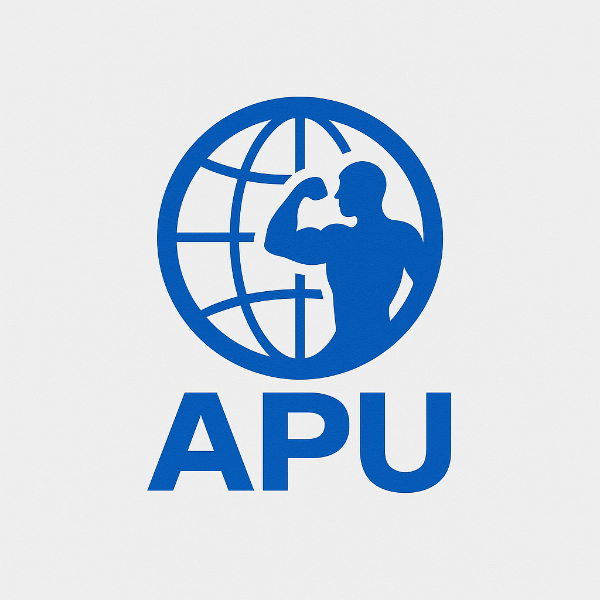

# Fundamentals of Web Development (FDD)

  
  <h1>APUFit</h1>

## Overview
This repository contains materials related to the APUFit Club website development project. The project focuses on creating a web presence for the student-initiated health and wellness organization at Asia Pacific University (APU).

## Project Scope
The APUFit Club website aims to:
- Showcase the club's activities and events
- Provide information about fitness programs
- Create specialized sport-specific sections
- Promote health and wellness among APU students and staff

## Requirements
Each student will develop:
- One main/general APUFit Club page (Home, About, etc.)
- 4-5 interlinked pages focused on a specific sport

## Color Scheme
### Main page
- Primary (Headers & Key Titles): Royal Blue #0057B7
- Accent (Icons, Emphasis): Sky Blue #4FC3F7
- Text (Body): Charcoal #2E2E2E
- Background (Sections or callouts): Light Gray #F5F7FA

### Basketball
- Primary (Headers & Key Titles): Orange #FF7F00
- Accent (Icons, Emphasis): Dark Brown #8B4513
- Text (Body): Black #000000
- Background (Sections or callouts): Light Orange #FFE4B5

## Getting Started
1. Clone this repository
2. Open index.html in your favourite browser.

or just
1. Open [FDD](https://fdd.nodr.me)!